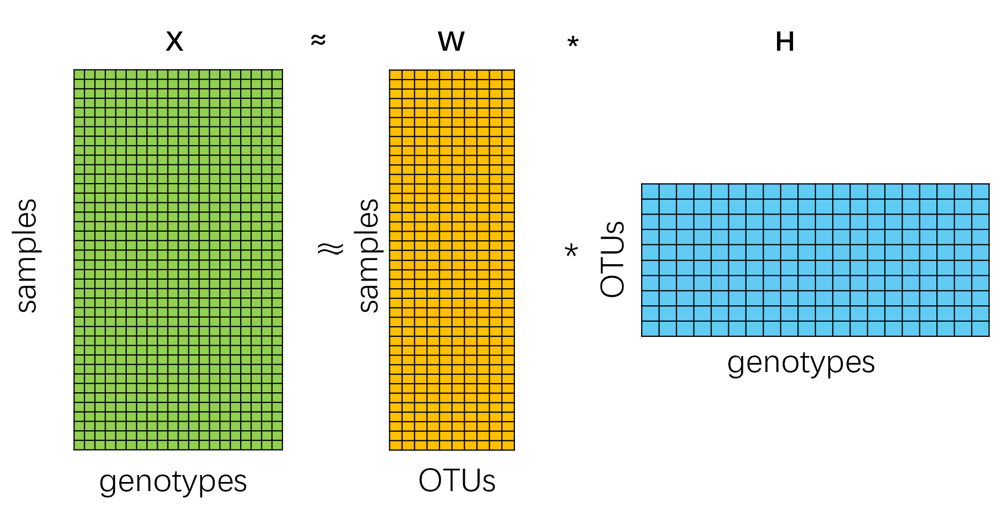
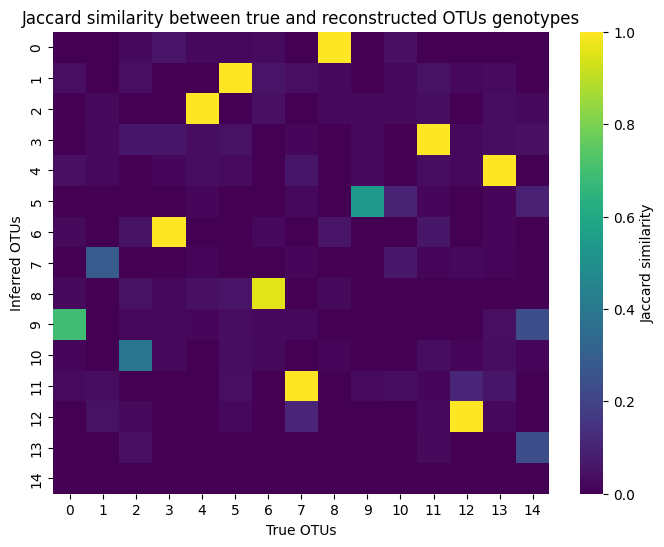

# NMF-OTUs-Reconstruction
A Non-negative Matrix Factorization Framework for Decomposing OTUs Genotypes and Their Abundance Reconstruction in Metagenomic Data.

## Overview

This repository provides a comprehensive pipeline for:
1. **Simulating metagenomic data** with known OTUs genotypes as gold standard
2. **Decomposing sample-genotype matrices** into samples-OTUs abundance and OTUs-genotypes components using NMF
3. **Evaluating reconstruction accuracy** using Jaccard similarity

Our results demonstrate that NMF can effectively reconstruct OTU genotypes from mixed metagenomic samples, with **9 out of 15 simulated OTUs successfully recovered** in our benchmark.

## Features

### 🧬 Data Simulation
- Generate realistic metagenomic sequences with customizable parameters:
  - Sequence length (default: 200bp)
  - Number of OTUs (default: 15)
  - Samples count (default: 300)
  - Shared mutation numbers
  - Unique mutation numbers
- Creates gold standard data for method validation

### 🔬 NMF Decomposition
- Implement Non-negative Matrix Factorization to decompose:
  - **Input**: Samples × Genotypes matrix
  - **Output**: 
    - Samples × OTUs (abundance matrix)
    - OTUs × Genotypes (feature matrix)
- Export one-hot encoded genetic sequences

### 📊 Evaluation Framework
- **Jaccard similarity** for genotype reconstruction accuracy
- Visualization tools for comparing true vs reconstructed OTUs

